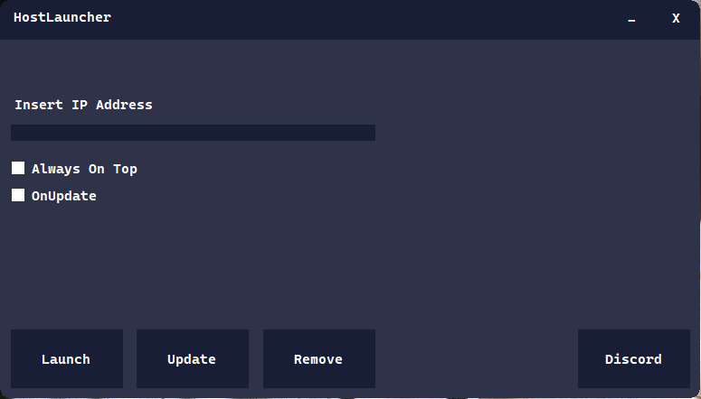

## 💻 HostLauncher
HostLauncher is an application programmed in C#, the purpose of this program is to withstand the needs of Growtopia Private Server user, especially those who plays on Windows.

## ❓ How To Build
Make sure you have the latest Visual Studio 2022 installed, or else it won't work (You can change the VS build settings to make it work) 
 1. Change the build mode to **Release**
 2. Click on your keyboard **CTRL + SHIFT + B**
 3. And there you have it, locate the build files on the **bin/** folder